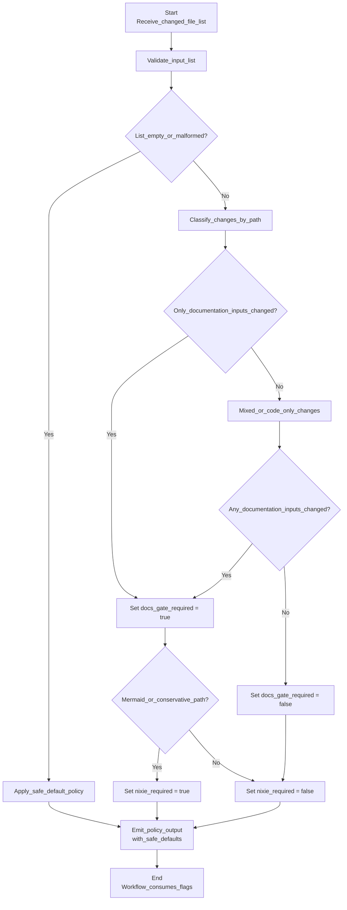

# Users guide

This guide is for contributors and operators who need to understand the
user-visible behaviour of repovec-appliance and its repository automation. It
focuses on what a user can expect to happen, not on the internal crate layout.

## Documentation gate decisions

When a change reaches continuous integration (CI), the workflow decides whether
documentation validation is required and whether Mermaid diagram validation
should also run. The decision is based on the changed-file list, whether any
documentation-tooling configuration changed, and, for Markdown files, whether
the current file contents contain Mermaid diagrams.

Figure 1. Accessible flow diagram showing how the CI policy decides whether the
documentation gate and Mermaid validation are required from the changed-file
list, including the conservative fallback path used when the list is empty or
malformed.



In practice, the current policy behaves as follows:

- If the changed-file list is unavailable, CI runs both the documentation gate
  and Mermaid validation as a safe default.
- If no documentation inputs changed, the documentation gate is skipped.
- If Markdown files changed, the documentation gate runs.
- If documentation-tooling configuration changed, the documentation gate and
  Mermaid validation both run as a conservative default.
- Mermaid validation runs only when one of the changed Markdown files contains
  a Mermaid diagram, or when the workflow takes that conservative fallback.

The CI workflow publishes these decisions as stable flags so the `docs-gate`
job can stay required even when it skips documentation-specific work. When the
workflow takes the conservative Mermaid path because a file could not be read,
it also publishes which files triggered that fallback.

## Qdrant service

repovec-appliance ships Qdrant as an appliance-internal Podman Quadlet.
Operators should treat it as a local dependency of the appliance rather than a
general-purpose network service.

The checked-in Quadlet is installed to
`/etc/containers/systemd/qdrant.container`. It tracks the official Qdrant
`docker.io/qdrant/qdrant:v1` image stream and enables `AutoUpdate=registry` so
the systemd-managed container can participate in Podman's registry-based
auto-update flow within the current major version.

Qdrant's REST and gRPC ports are published only on loopback:

- REST: `127.0.0.1:6333`
- gRPC: `127.0.0.1:6334`

Persistent vector storage lives at `/var/lib/repovec/qdrant-storage` on the
host and is mounted into the container at `/qdrant/storage`. The mount uses an
explicit `:Z` SELinux relabel so the rootful Podman service can write to the
directory on enforcing hosts.

Qdrant requires an API key. On first boot, `repovec-qdrant-api-key.service`
generates a random raw key at `/etc/repovec/qdrant-api-key`, restricts the file
to `repovec:repovec` with mode `0400`, and refreshes the rootful Podman secret
`repovec-qdrant-api-key`. The Qdrant Quadlet injects that Podman secret as
`QDRANT__SERVICE__API_KEY` inside the container.

Operators can inspect service state without printing the key:

```sh
systemctl status repovec-qdrant-api-key.service qdrant.service
journalctl -u repovec-qdrant-api-key.service
stat -c '%U:%G %a %n' /etc/repovec/qdrant-api-key
podman secret inspect repovec-qdrant-api-key
```

Local clients authenticate by reading the key as the `repovec` user and sending
it in Qdrant's `api-key` header:

```sh
sudo -u repovec sh -c \
  'api_key="$(cat /etc/repovec/qdrant-api-key)"
  curl --config - http://127.0.0.1:6333/collections <<EOF
header = "api-key: ${api_key}"
EOF'
```

Requests to Qdrant without the `api-key` header are rejected.

### Qdrant API-key provisioning behaviour

#### `REPOVEC_DEBUG` environment variable

Setting `REPOVEC_DEBUG=1` enables debug-level log lines emitted to stderr by
the `repovec-qdrant-api-key` helper.  When enabled, the helper logs lock
acquisition and release events alongside other diagnostic output.  This
variable is intended for troubleshooting only.  It must not be set in
production systemd service units, and the default behaviour (no debug output)
is safe for production.

#### Flock-based serialization

The `repovec-qdrant-api-key` helper serializes all mutable operations behind an
exclusive `flock` on `/etc/repovec/repovec-qdrant-api-key.lock`.  Concurrent
invocations block until the lock is available, preventing races between user
creation, directory creation, secret inspection, key generation, and secret
creation.  The lock file is owned by `root:root` and resides in `/etc/repovec`,
a root-owned directory with mode `0750` that is not world-writable.  This
ensures that an unprivileged process cannot substitute the lock file to
interfere with serialization.

#### Fail-closed secret-removal behaviour

If `podman secret rm` fails for any reason other than the secret being in use,
the helper exits non-zero.  The caller (systemd) sees a unit failure rather
than silently continuing with stale credentials.  When the removal fails
because the secret is in use (`podman secret rm` reports "in use"), the helper
exits zero because the existing secret remains valid and does not need to be
replaced.  This fail-closed invariant ensures that an unexpected removal error
never results in the Qdrant Quadlet running with an outdated or missing API
key.

### Qdrant Quadlet validation diagnostics

`repovec_core::appliance::qdrant_quadlet` exposes `validate_qdrant_quadlet` and
the public `QdrantQuadletError` type for checking the packaged Quadlet
contract. The validator reports the first contract violation it finds. Display
strings are stable operator diagnostics and use these formats:

The validator is a static contract check. It does not emit tracing spans, logs,
or metrics itself; callers should log or count the returned
`QdrantQuadletError` when they need runtime observability.

- `InvalidLine`: `invalid quadlet line {line_number}: {line}`.
- `PropertyBeforeSection`:
  `quadlet property before section on line {line_number}: {line}`.
- `MissingImage`: `missing Image= entry in [Container]`.
- `ImageNotFullyQualified`:
  `image reference must be fully qualified and tagged: {image}`.
- `UnexpectedImage`:
  `image reference must remain docker.io/qdrant/qdrant:v1: {image}`.
- `MissingRestPort`: `missing PublishPort=6333 in [Container]`.
- `MissingGrpcPort`: `missing PublishPort=6334 in [Container]`.
- `PortNotBoundToLoopback`:
  `port {port} must be published on 127.0.0.1 only: {publish_port}`.
- `MissingStorageMount`: `missing persistent Qdrant storage mount`.
- `IncorrectStorageSource`:
  `storage source must be /var/lib/repovec/qdrant-storage: {source}`.
- `IncorrectStorageTarget`:
  `storage target must be /qdrant/storage: {target}`.
- `MissingSelinuxRelabel`:
  `storage mount must include SELinux relabel :Z: {volume}`.
- `MissingAutoUpdate`: `missing AutoUpdate= entry in [Container]`.
- `IncorrectAutoUpdate`: `AutoUpdate must remain registry: {auto_update}`.
- `MissingApiKeyProvisioningDependency`:
  `missing {directive}=repovec-qdrant-api-key.service dependency for Qdrant`
  `API-key provisioning`.
- `IncorrectApiKeyProvisioningDependency`:
  `{directive} must include repovec-qdrant-api-key.service for Qdrant`
  `API-key provisioning: {dependency}`.
- `MissingApiKeySecret`:
  `missing Secret=repovec-qdrant-api-key,type=env,target=QDRANT__SERVICE__API_KEY`.
- `IncorrectApiKeySecret`:
  `Qdrant API-key secret must be repovec-qdrant-api-key,type=env,`
  `target=QDRANT__SERVICE__API_KEY: {secret}`.
- `InlineApiKeyEnvironmentDisallowed`:
  `Qdrant API keys must use a Podman secret, not inline Environment=: <redacted>`.

## Appliance systemd target

repovec-appliance ships a base systemd target and static daemon service files
under `packaging/systemd/`:

- `repovec.target`
- `repovecd.service`
- `repovec-mcpd.service`
- `repovec-grepai@.service`

Install these files to `/etc/systemd/system/`, then reload systemd:

```sh
sudo install -m 0644 packaging/systemd/repovec.target /etc/systemd/system/repovec.target
sudo install -m 0644 packaging/systemd/repovecd.service /etc/systemd/system/repovecd.service
sudo install -m 0644 packaging/systemd/repovec-mcpd.service /etc/systemd/system/repovec-mcpd.service
sudo install -m 0644 packaging/systemd/repovec-grepai@.service /etc/systemd/system/repovec-grepai@.service
sudo systemctl daemon-reload
```

The target wants `qdrant.service`, `repovecd.service`, `repovec-mcpd.service`,
and `cloudflared.service`. The Qdrant service name is the generated systemd
unit from the installed `/etc/containers/systemd/qdrant.container` Quadlet;
dependent services must use `qdrant.service`.

`repovec-grepai@.service` is the template used for future per-repository
indexer instances. It runs `grepai watch` as the `repovec` user, sets
`HOME=/var/lib/repovec`, works in `/var/lib/repovec/worktrees/<instance>`, and
writes stdout and stderr to journald. Later reconciliation work creates and
manages concrete instances; operators should not expect installing the template
alone to start indexers.

Enable and start the appliance service group with:

```sh
sudo systemctl enable repovec.target
sudo systemctl start repovec.target
```

> **Note:** `repovecd` and `repovec-mcpd` validate the checked-in systemd unit
> contract at startup before doing any other work. If validation fails, the
> daemon exits immediately with a non-zero exit code. Inspect the journal with
> `journalctl -u repovecd.service --no-pager | tail -20` or
> `journalctl -u repovec-mcpd.service --no-pager | tail -20`; the error message
> identifies the unit and contract clause that was violated.

### Startup validation logging

Both `repovecd` and `repovec-mcpd` validate their checked-in systemd unit
contracts at startup before starting any async work. The outcome is observable
in the systemd journal:

**Success** — a `TRACE`-level event followed by a `DEBUG`-level confirmation:

```text
TRACE systemd unit contract validated
DEBUG systemd unit contract validated at daemon startup
```

**Failure** — an `ERROR`-level event with structured fields identifying the
violating unit and the nature of the failure, followed by a non-zero process
exit:

```text
ERROR systemd unit contract violation — aborting startup
  unit=repovecd.service
  error=repovecd.service is missing [Service]
```

The `unit` field contains the logical systemd unit name (e.g.
`repovecd.service`) and the `error` field contains the human-readable
description of the contract violation. Pass `--log-level trace` (or set
`RUST_LOG=trace`) to see the `TRACE` and `DEBUG` events; only `ERROR` events
are visible at the default log level.

Starting the target may still fail until later roadmap items create the
`repovec` system user, directory layout, Qdrant API-key configuration, and
production daemon binaries. The checked-in unit contract already records the
intended ordering: `repovecd.service` starts after and requires Qdrant, and
`repovec-mcpd.service` starts after and requires both Qdrant and `repovecd`.
Concrete grepai indexer instances also start after and require both Qdrant and
`repovecd`.
