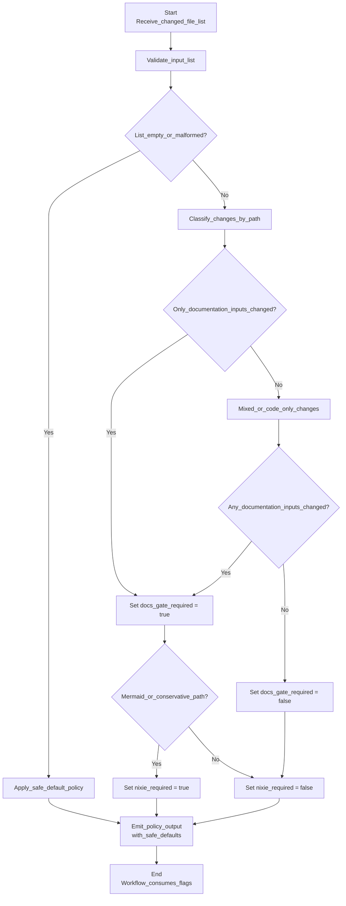

# Users guide

This guide is for contributors and operators who need to understand the
user-visible behaviour of repovec-appliance and its repository automation. It
focuses on what a user can expect to happen, not on the internal crate layout.

## Documentation gate decisions

When a change reaches continuous integration (CI), the workflow decides whether
documentation validation is required and whether Mermaid diagram validation
should also run. The decision is based on the changed-file list, whether any
documentation-tooling configuration changed, and, for Markdown files, whether
the current file contents contain Mermaid diagrams.

Figure 1. Accessible flow diagram showing how the CI policy decides whether the
documentation gate and Mermaid validation are required from the changed-file
list, including the conservative fallback path used when the list is empty or
malformed.



In practice, the current policy behaves as follows:

- If the changed-file list is unavailable, CI runs both the documentation gate
  and Mermaid validation as a safe default.
- If no documentation inputs changed, the documentation gate is skipped.
- If Markdown files changed, the documentation gate runs.
- If documentation-tooling configuration changed, the documentation gate and
  Mermaid validation both run as a conservative default.
- Mermaid validation runs only when one of the changed Markdown files contains
  a Mermaid diagram, or when the workflow takes that conservative fallback.

The CI workflow publishes these decisions as stable flags so the `docs-gate`
job can stay required even when it skips documentation-specific work. When the
workflow takes the conservative Mermaid path because a file could not be read,
it also publishes which files triggered that fallback.

## Qdrant service

repovec-appliance ships Qdrant as an appliance-internal Podman Quadlet.
Operators should treat it as a local dependency of the appliance rather than a
general-purpose network service.

The checked-in Quadlet is installed to
`/etc/containers/systemd/qdrant.container`. It tracks the official Qdrant
`docker.io/qdrant/qdrant:v1` image stream and enables `AutoUpdate=registry` so
the systemd-managed container can participate in Podman's registry-based
auto-update flow within the current major version.

Qdrant's REST and gRPC ports are published only on loopback:

- REST: `127.0.0.1:6333`
- gRPC: `127.0.0.1:6334`

Persistent vector storage lives at `/var/lib/repovec/qdrant-storage` on the
host and is mounted into the container at `/qdrant/storage`. The mount uses an
explicit `:Z` SELinux relabel so the rootful Podman service can write to the
directory on enforcing hosts.

Qdrant requires an API key. On first boot, `repovec-qdrant-api-key.service`
generates a random raw key at `/etc/repovec/qdrant-api-key`, restricts the file
to `repovec:repovec` with mode `0400`, and refreshes the rootful Podman secret
`repovec-qdrant-api-key`. The Qdrant Quadlet injects that Podman secret as
`QDRANT__SERVICE__API_KEY` inside the container.

Operators can inspect service state without printing the key:

```sh
systemctl status repovec-qdrant-api-key.service qdrant.service
stat -c '%U:%G %a %n' /etc/repovec/qdrant-api-key
podman secret inspect repovec-qdrant-api-key
```

Local clients authenticate by reading the key as the `repovec` user and sending
it in Qdrant's `api-key` header:

```sh
sudo -u repovec sh -c \
  'curl -H "api-key: $(cat /etc/repovec/qdrant-api-key)" \
  http://127.0.0.1:6333/collections'
```

Requests to Qdrant without the `api-key` header are rejected.
